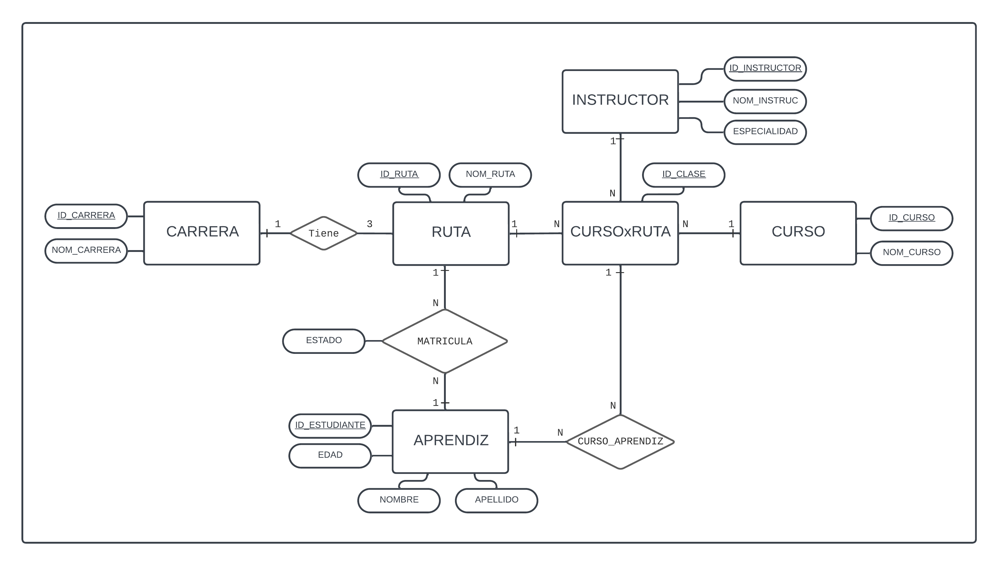
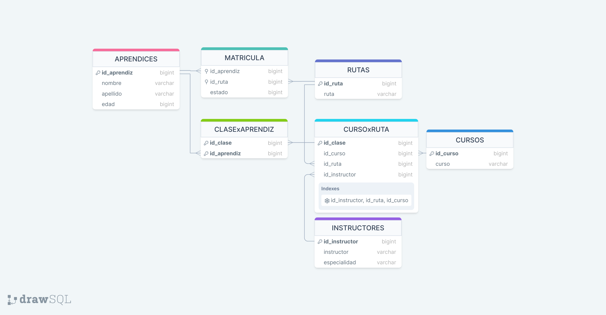

# PROYECTO_BD_SENA

#### *Problematica*
El Servicio Nacional de Aprendizaje SENA está implementando sus nuevas rutas de aprendizaje basada en cursos interrelacionados, en la que una carrera consta de varios cursos consecutivos organizados en rutas.
Realice un diagrama entidad-relación, el modelo relacional y el modelo físico de datos en el que se pueda apoyar el sistema de información para guardar ordenada y eficientemente la información académica de todas las entidades presentes en este contexto.

---
#### *Diagrama Entidad-Relación*
A continuación, se presenta el diagrama Entidad - Relación propuesto para la solución a la problematica:


---
#### *Modelo Relacional*
Basados en el diagrama Entidad-Relación planteado, se realizó el siguiente modelo relacional para dar inicio a la construcción de la Base de datos.


---
#### *Modelo Fisico de Datos*
El siguiente bloque de codigo crea la Base de datos mysql junto con sus respectivas tablas basadas en el modelo relacional, y la pobla con los datos adjuntos en el requerimiento del proyecto:
```sql
DROP DATABASE IF EXISTS SENA;
CREATE DATABASE SENA;
USE SENA;
SHOW TABLES;
DROP TABLE IF EXISTS Carrera;
CREATE TABLE Carrera (
    `id` int NOT NULL AUTO_INCREMENT,
    `name` varchar(32) NOT NULL,
    PRIMARY KEY (`id`)
    );
INSERT INTO Carrera 
VALUES (1,'Desarrollo de Software'), (2,'Electrónica'), (3,'Mecánica Automotriz'), (4,'Seguridad y Salud Ocupacional'), (5,'Soldadura');

DROP TABLE IF EXISTS Cursos;
CREATE TABLE Cursos (
    `id_curso` int NOT NULL AUTO_INCREMENT,
    `curso` varchar(32) NOT NULL,
    PRIMARY KEY (`id_curso`)
    );
INSERT INTO Cursos VALUES (1,'Matemáticas Básicas'),(2,'Álgebra Computacional'),(3,'Programación Básica'),(4,'Inglés'),(5,'Electrónica Básica'),(6,'Motor de Cuatro Tiempos'),(7,'Enfermedades Laborales'),(8,'Higiene Postural en el Trabajo'),(9,'Ergonomía'),(10,'Legislación Laboral en Colombia'),(11,'Materiales de Soldadura'),(12,'Métodos de Soldadura'),(13,'Fusión de Metales'),(14,'Buceo 1'),(15,'Buceo 2'),(16,'Riesgo Eléctrico'),(17,'Bases de Datos Relacionales'),(18,'Bases de Datos NO Relacionales'),(19,'Electrónica Digital'),(20,'Microprocesadores');

DROP TABLE IF EXISTS Aprendices;
CREATE TABLE Aprendices (
     `id_aprendiz` int NOT NULL AUTO_INCREMENT,
     `nombre` varchar(32) NOT NULL,
     `apellido` varchar(32) NOT NULL,
     `edad` int NOT NULL,
     PRIMARY KEY (`id_aprendiz`)
     );
INSERT INTO Aprendices VALUES (1, 'Carlos Saúl', 'Gómez', 17), (2, 'Leyla María', 'Delgado Vargas', 18), (3, 'Juan José', 'Martinez', 19), (4, 'Sergio Augusto' , 'Contreras Navas', 20), (5, 'Ana María', 'Velasquez Parra', 17), (6, 'Gustavo', 'Noriega Alzate', 18), (7, 'Pedro Nell', 'Gómez Díaz', 19), (8, 'Jairo Augusto', 'Castro Camargo', 20), (9, 'Henry', 'Soler Vega', 17), (10, 'Antonio', 'Cañate Cortés', 18), (11, 'Daniel', 'Simancas Junior', 19);

DROP TABLE IF EXISTS Rutas;
CREATE TABLE Rutas (
     `id_ruta` int NOT NULL AUTO_INCREMENT,
     `ruta` varchar(50) DEFAULT NULL,
     `id_carrera` int NOT NULL,
     PRIMARY KEY (`id_ruta`),
     CONSTRAINT `ruta_carrera` FOREIGN KEY (`id_carrera`) REFERENCES `Carrera` (`id`)
    );
INSERT INTO Rutas VALUES (1,'Sistemas de Información Empresariales',1),(2,'Videojuegos',1),(3,'Machine Learning',1),(4,'Microcontroladores',2),(5,'Robótica',2),(6,'Dispositivos Bio-médicos',2),(7,'Motores Híbridos',3),(8,'Vehículos de Uso Agrícola',3),(9,'Sistemas de Gestión en Seguridad Ocupacional',4),(10,'Soldadura Autógena Industrial',5),(11,'Soldadura Eléctrica Industrial',5),(12,'Soldadura Submarina',5);

DROP TABLE IF EXISTS Instructores;
CREATE TABLE Instructores (
     `id_instructor` int NOT NULL AUTO_INCREMENT,
     `instructor` varchar(32) NOT NULL,
     `especialidad` varchar(32) NOT NULL,
     PRIMARY KEY (`id_instructor`)
     );
INSERT INTO Instructores VALUES (1, 'Ricardo Vicente Jaimes', 'Sistemas'), (2, 'Marinela Narvaez', 'Salud Ocupacional'), (3, 'Agustín Parra Granados', 'Soldadura'), (4, 'Nelson Raúl Buitrago', 'Mecánica'), (5, 'Roy Hernando Llamas', 'Inglés'), (6, 'Maria Jimena Monsalve', 'Electrónica'), (7, 'Juan Carlos Cobos', 'Electrónica'), (8, 'Pedro Nell Santoamaría', 'Sistemas'), (9, 'Andrea González', 'Sistemas'), (10, 'Marisela Sevilla', 'Salud Ocupacional');

DROP TABLE IF EXISTS Matricula;
CREATE TABLE Matricula (
    `id_aprendiz` int NOT NULL,
    `id_ruta` int NOT NULL,
    `estado` ENUM('En Ejecución', 'Terminado', 'Cancelado'),
    FOREIGN KEY (id_aprendiz) REFERENCES Aprendices (id_aprendiz),
    FOREIGN KEY (id_ruta) REFERENCES Rutas (id_ruta),
    CONSTRAINT MatriculaxAprendiz UNIQUE (id_aprendiz, id_ruta, estado)
);
INSERT INTO Matricula VALUES (1,1,1),(2,1,1),(3,2,3),(4,2,1),(5,3,1),(6,4,2),(7,4,2),(8,5,2),(9,5,3),(10,11,2),(11,10,2);


DROP TABLE IF EXISTS Cursos_Ruta;
CREATE TABLE Cursos_Ruta (
    `id_clase` int NOT NULL AUTO_INCREMENT,
    `id_ruta` int NOT NULL,
    `id_curso` int NOT NULL,
    `id_instructor` int NULL,
    CONSTRAINT CursoxRuta UNIQUE (id_ruta, id_curso, id_instructor),
    PRIMARY KEY (id_clase)
);
INSERT INTO Cursos_Ruta(id_ruta, id_curso, id_instructor) VALUES (1,17,2), (1,2,1), (1,18,2), (1,1,4), (1,3,3), (1,4,5), (2,1,4), (2,2,1), (2,3,3), (2,4,5), (3,3,3), (3,4,5), (3,17,2), (4,5,7), (4,19,6), (4,20,7), (5,5,7), (5,19,6), (5,20,7), (11,11,3), (11,13,3), (10,12,3), (10,14,NULL);

DROP TABLE IF EXISTS Clase_Aprendiz;
CREATE TABLE Clase_Aprendiz (
    `id_aprendiz` int NOT NULL,
    `id_clase` int NOT NULL,
    FOREIGN KEY (id_aprendiz) REFERENCES Aprendices (id_aprendiz),
    FOREIGN KEY (id_clase) REFERENCES Cursos_Ruta (id_clase),
    PRIMARY KEY (id_aprendiz, id_clase)
);
INSERT INTO Clase_Aprendiz VALUES (1,1), (1,2), (1,5), (1,3), (2,4), (2,2), (2,5), (2,6), (3,7), (3,8), (3,9), (4,10), (4,7), (4,8), (5,11), (5,12), (5,13), (6,14), (6,15), (6,16), (7,14), (7,15), (7,16), (8,17), (8,18), (9,17), (9,18), (9,19), (10,20), (10,21), (11,22), (11,23);

```
---

#### *Vista General de la Base de Datos*
```sql
DROP VIEW IF EXISTS Vista_General;
CREATE VIEW Vista_General AS
SELECT M.estado AS ESTADO, CONCAT(A.nombre, ' ', A.apellido) AS APRENDIZ, Car.name AS CARRERA, R.ruta AS RUTA, C.curso AS CURSO, I.instructor AS INSTRUCTOR
FROM Matricula M 
INNER JOIN Aprendices A ON M.id_aprendiz=A.id_aprendiz
INNER JOIN Clase_Aprendiz Ca ON Ca.id_aprendiz=A.id_aprendiz
INNER JOIN Cursos_Ruta Cr ON Cr.id_clase=Ca.id_clase
INNER JOIN Rutas R ON R.id_ruta=Cr.id_ruta
INNER JOIN Carrera Car ON Car.id=R.id_carrera
INNER JOIN Cursos C ON C.id_curso=Cr.id_curso
LEFT JOIN Instructores I ON I.id_instructor=Cr.id_instructor;
```

#### *Consultas en la Base de Datos*
1. Agregue un campo Estado_Matrícula a la tabla Matrícula que indique si el
estudiante se encuentra “En Ejecución”, “Terminado” o “Cancelado”.
```sql
ALTER TABLE Matricula
ADD Estado_Matricula ENUM('En Ejecución', 'Terminado', 'Cancelado');
```
2. Agregue a el campo edad a la tabla de Aprendices.
```sql
ALTER TABLE Aprendices
ADD edad int NOT NULL;
```
3. Si suponemos que los cursos tienen una duración diferente dependiendo de la ruta que lo contenga ¿qué modificación haría a la estructura de datos ya planteada?
```sql
ALTER TABLE Cursos_Ruta 
ADD Duración int NOT NULL;
```
4. Seleccionar los nombres y edades de aprendices que están cursando la carrera de electrónica.
```sql
SELECT CONCAT(A.nombre, ' ', A.apellido), A.edad  FROM Aprendices A INNER JOIN Matricula M ON A.id_aprendiz=M.id_aprendiz WHERE M.id_ruta IN (SELECT id_ruta FROM Rutas WHERE id_carrera=2);
```

5. Seleccionar Nombres de Aprendices junto al nombre de la ruta de aprendizaje que cancelaron.
```sql
SELECT CONCAT(A.nombre, ' ', A.apellido) AS Aprendiz, A.edad, R.ruta AS Ruta_Cancelada FROM Aprendices A JOIN Matricula M ON M.id_aprendiz=A.id_aprendiz JOIN Rutas R ON M.id_ruta=R.id_ruta WHERE M.estado='Cancelado';
```

6. Seleccionar Nombre de los cursos que no tienen un instructor asignado.
```sql 
SELECT R.ruta,C.curso FROM Cursos C INNER JOIN Cursos_Ruta CR ON C.id_curso=CR.id_curso INNER JOIN Rutas R on R.id_ruta=CR.id_ruta WHERE CR.id_instructor IS NULL;
```

7. Seleccionar Nombres de los instructores que dictan cursos en la ruta de aprendizaje “Sistemas de Información Empresariales”.
```sql
SELECT DISTINCT I.instructor AS Instructor_Sistemas_de_Información_Empresariales FROM Instructores I INNER JOIN Cursos_Ruta CR ON I.id_instructor=CR.id_instructor INNER JOIN Rutas R ON R.id_ruta=CR.id_ruta WHERE R.ruta='Sistemas de Información Empresariales';
```

8. Genere un listado de todos los aprendices que terminaron una Carrera mostrando el nombre del profesional, el nombre de la carrera y el énfasis de la carrera (Nombre de la Ruta de aprendizaje).
```sql
SELECT CONCAT(A.nombre, ' ', A.apellido) AS Profesional, Ca.name AS Carrera, R.ruta AS Énfasis FROM Aprendices A INNER JOIN Matricula M ON A.id_aprendiz=M.id_aprendiz INNER JOIN Rutas R ON R.id_ruta=M.id_ruta INNER JOIN Carrera Ca ON R.id_carrera=Ca.id WHERE M.estado='Terminado';
```

9. Genere un listado de los aprendices matriculados en el curso “Bases de Datos Relacionales”.
```sql
SELECT CONCAT(A.nombre, ' ', A.apellido) AS Aprendiz FROM Aprendices A INNER JOIN Clase_Aprendiz CA ON A.id_aprendiz=CA.id_aprendiz INNER JOIN Cursos_Ruta CR ON CA.id_clase=CR.id_clase INNER JOIN Cursos C ON CR.id_curso=C.id_curso WHERE C.curso='Bases de Datos Relacionales';
```

10. Nombres de Instructores que no tienen curso asignado.
```sql
SELECT I.instructor AS Instructores_sin_Cursos FROM Instructores I LEFT JOIN Cursos_Ruta CR ON I.id_instructor=CR.id_instructor WHERE CR.id_instructor IS NULL;
```
---
#### *Banco de Preguntas SQL*
A continuación se presentan 4 preguntas de selección multiple referentes al tema de bases de datos relacionales SQL, con sus respectivas respuestas.

* Si tienes una tabla llamada "Empleados" con columnas como "ID", "Nombre", y "Salario", ¿cuál sería la consulta SQL para seleccionar todos los empleados que ganan más de $50,000?

        a) SELECT * FROM Empleados WHERE Salario > 50000;
        b) SELECT Nombre FROM Empleados WHERE Salario > 50000;
        c) SELECT * FROM Empleados HAVING Salario > 50000;
        d) FILTER * FROM Empleados WITH Salario > 50000;

    Respuesta Correcta: a) 
---
* ¿Cómo se suele implementar una relación muchos a muchos entre dos entidades en una base de datos relacional?

        a) Agregando una columna de clave foránea en una de las tablas.
        b) Creando una tabla intermedia que contiene claves foráneas hacia ambas tablas.
        c) Utilizando vistas para combinar los datos de las dos tablas.
        d) Estableciendo una relación directa entre las claves primarias de ambas tablas.

    Respuesta Correcta: b) 
---
* En el modelo relacional, ¿cómo se define una dependencia funcional completa?

        a) Cuando una columna determina el valor de otra columna y viceversa.
        b) Cuando una columna determina el valor de otra columna, pero no viceversa.
        c) Cuando dos columnas determinan el valor de una tercera columna.
        d) Cuando una columna determina el valor de otra columna solo si se cumplen ciertas condiciones.

    Respuesta Correcta: b) 
---
* Supongamos que tienes una tabla llamada Ventas con una columna FechaVenta de tipo DATETIME. ¿Cuál de las siguientes consultas devuelve la cantidad total de ventas realizadas en el último mes?

        a) SELECT COUNT(*) FROM Ventas WHERE MONTH(FechaVenta) = MONTH(CURDATE()) AND YEAR(FechaVenta) = YEAR(CURDATE());

        b) SELECT COUNT(*) FROM Ventas WHERE FechaVenta = LAST_MONTH(NOW());

        c) SELECT COUNT(*) FROM Ventas WHERE FechaVenta = DATE_SUB(CURDATE(), INTERVAL 1 MONTH);

        d) SELECT COUNT(*) FROM Ventas WHERE FechaVenta BETWEEN DATE_SUB(CURDATE(), INTERVAL 1 MONTH) AND CURDATE();

    Respuesta Correcta: d) 


